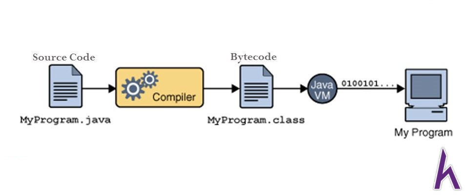
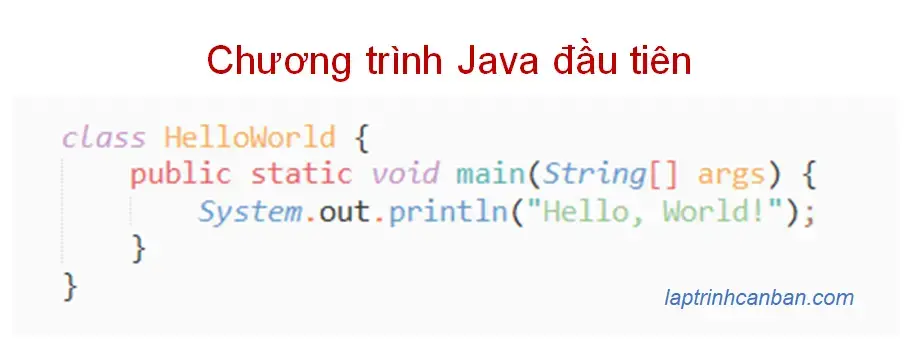
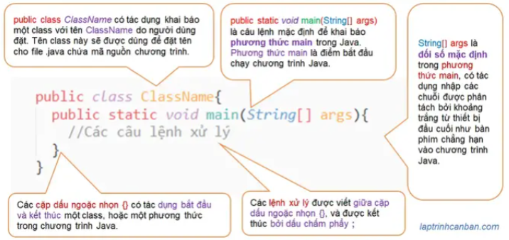
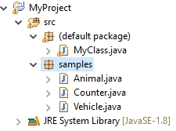
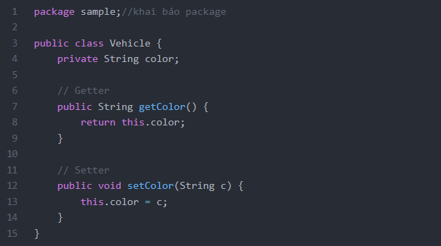
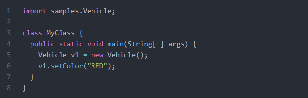
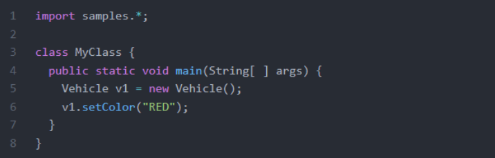
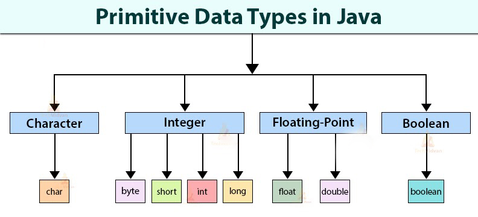
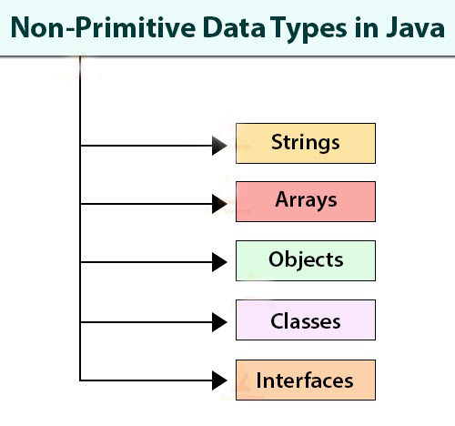

# [JAVA] - BUỔI 1
# WELCOME TO JAVA

## I. Ngôn ngữ Java

- Khái niệm: Java là một một ngôn ngữ lập trình hiện đại, bậc cao, hướng đối tượng, bảo mật và mạnh mẽ.

## II. Lí do ra đời của Java

- Java ra đời với tiêu chí “Viết một lần, thực thi mọi nơi” (“Write Once, Run Anywhere). Chương trình phần mềm bằng Java có thể chạy trên mọi nền tảng (Platform) khác nhau thông qua môi trường thực thi với điều kiện môi trường thực thi thích hợp trên nền tảng hệ điều hành đó. Ví dụ bạn chỉ cần viết một lần trên Windows, sau đó vẫn chương trình đó bạn có thể chạy trên Linux, Android,...
- Platform: Bất cứ môi trường phần cứng hoặc phần mềm nào mà trong đó có một chương trình chạy, thì được hiểu như là một Platform.

    

## III. Cách Java hoạt động

- `Compiler` hay còn gọi là `Trình biên dịch`, là một chương trình có nhiệm vụ dịch các các code của một ngôn ngữ lập trình tương ứng thành một chương trình tương đương của ngôn ngữ cấp thấp hơn (thường là ngôn ngữ máy).
- `Javac` chính là **Compiler** của java, `Javac` sẽ dịch code Java sang mã **bytecode**, **bytecode** chính là vị trí trung gian giữa mã nguồn (ở đây là java) và mã máy (machine code). Thông qua **Java VM** sẽ chuyển **bytecode** sang mã máy để chạy chương trình.

## IV. Cấu trúc một chương trình Java

- Chương trình (computer program) là một tập hợp các xử lý được ghi theo thứ tự mà máy tính cần phải thực hiện. Trong ngôn ngữ Java, một chương trình là một tập hợp các class, với mỗi class là một tập hợp nhằm thực hiện một công việc cụ thể nào đó trong chương trình.

    

- Cấu trúc cơ bản của chương trình Java như sau:

``` java
public class ClassName{
  public static void main(String[] args){
    //Các câu lệnh xử lý
  }
}
```

- Trong đó, các phần trong cú pháp của Java có ý nghĩa như sau:

    

- Ngoài ra, một chương trình Java còn  có các thành phần khác là chú thích (comments), gói (package), từ khóa (keywords), chỉ định truy cập (access modifiers), câu lệnh (statements), khối (blocks), lớp (classes), phương thức (methods), phương thức main (main method).
  - Comments giống C++;
  - Package là tập hợp các lớp, các package con

    

  - Một lớp thuộc package nào thì phải khai báo ở đầu file code định nghĩa lớp đó.

    

  - Để sử dụng các lớp thuộc package nào đó, phải sử dụng import.

    

  - Để nạp tất cả dùng dùng ký hiệu đại diện *.

    

  - Keywords là những từ có nghĩa xác định trước đối với trình biên dịch và không thể sử dụng cho các mục đích khác trong chương trình.
  Ví dụ: class, public, static, void,…
  - Access modifiers: Java sử dụng thành phần chỉ định truy cập để xác định phạm vi có thể truy cập của các thuộc tính, phương thức, lớp. Các access modifiers trong Java là public, private, default và protected.
  Trong Java còn có các thành phần non-access modifiers như static, abstract, synchronized, native, volatile,… để xác định các thuộc tính, phương thức, lớp có thể được sử dụng như thế nào.
  - Statements: Một câu lệnh (statement) đại diện cho một hoặc một chuỗi các hành động. Mọi câu lệnh trong Java đều kết thúc bởi một dấu chấm phẩy ( ; ).
  Ví dụ: `System.out.println("Hello World!");`
  - Blocks: Một cặp dấu ngoặc nhọn {} gom các câu lệnh thành một khối lệnh.
  Ví dụ: class block, method block,…
  - Classes: là thành phần thiết yếu trong xây dựng cấu trúc Java. Một class là một khuôn mẫu hay bản thiết kế cho các đối tượng. Một chương trình Java được xác định bằng cách sử dụng một hay nhiều class.
  - Methods: Phương thức (method) là một tập hợp các câu lệnh thực hiện một chức năng cụ thể nào đó trong chương trình. Các phương thức (method) trong Java phải luôn được định nghĩa trong lớp (class).
  - Main method: Cung cấp sự kiểm soát luồng chương trình. Trình biên dịch Java thực hiện ứng dụng bằng cách gọi đến main method.
  - Mọi chương trình Java phải có main method, nó là điểm khởi đầu khi thực hiện chương trình.

## V. Syntax cơ bản của Java

- Java phân biệt chữ hoa chữ thường
- Tên lớp: Chữ cái đầu tiên phải là chữ hoa, nếu tên được tạo thành từ một vài từ thì chữ cái đầu tiên của các từ phải được viết hoa
Ví dụ: `class MyFirstJavaClass`
- Tên phương thức: Chữ cái đầu tiên phải là chữ cái thường, nếu tên gồm nhiều từ thì từ từ thứ 2 trở đi các chữ cái đầu viết hoa
Ví dụ: `public void myMethodName()`
- `public static void main (String[] args)` – quá trình xử lý của chương trình bắt đầu từ phương thức main() là bắt buộc.

## VI. Khai báo biến nguyên thủy

- Cấu trúc `<kiểu dữ liệu> (dấu cách) <tên biến> ;`

  

- Giới hạn giống với c++

  

## VII. Làm quen với vòng lặp

- Cấu trúc

``` java
for( <khoi_tao>; <dieu_kien_dung>; <buoc_nhay> )
{
  <khối lệnh>;
}
```

- Giống C++

## VIII. Câu lệnh rẽ nhánh

- Cấu trúc

``` java
if <dieu_kien>
{
  <khối lệnh>;
}
else <khối lệnh> ;
```

- Giống C++
