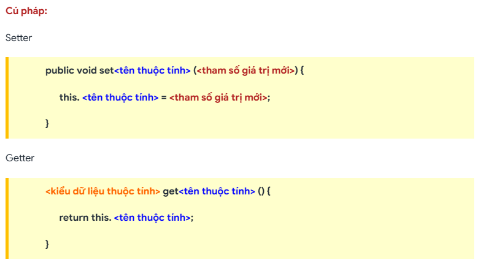
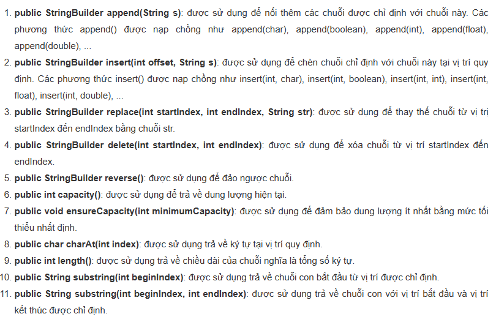

# [JAVA] - BUỔI 2

# LÀM QUEN VỚI CLASS VÀ OBJECT

## I. Tổng quan về Class và Object

### 1. Lập trình hướng đối tượng (OOP) là gì?

- Lập trình hướng đối tượng (Object Oriented Programming) là một kỹ thuật lập trình cho phép lập trình viên tạo ra các đối tượng trong code trừu tượng hóa các đối tượng thực tế trong cuộc sống.
- OOP bao gồm 2 phần chính là Class và Object.

### 2. Class và Object là gì?

- Đối tượng (Object) có thể là con người, điện thoại, máy tính, yasuo, leesin ... và điểm chung là đều gồm 2 thành phần chính là:
  - Thuộc tính (Attribute): là những thông tin, đặc điểm của đối tượng.
  - Phương thức (Method): là những hành động mà đối tượng có thể thực hiện.
- Ví dụ:
  - Máy tính sẽ có các thuộc tính: màu sắc, kích thước, bộ nhớ, ...
  - Và các phương thức: quét virus, tắt máy, khởi động máy, mở LoL ...
- Khi một đối tượng có những đặc tính như nhau sẽ được gom lại thành một lớp đối tượng (Class) và cũng sẽ có 2 thành phần là thuộc tính và phương thức. Lớp (Class) cũng có thể được dùng để định nghĩa một kiểu dữ liệu mới.
- Với ví dụ máy vi tính trên ta hiểu lớp (Class) máy vi tính có:
  - Các thuộc tính: màu sắc, kích thước, bộ nhớ, ...
  - Và các phương thức: quét virus, tắt máy, khởi động máy, mở LoL ...
  - Và đối tượng (Object) có thể là các dòng máy như Asus, Acer, Lenovo, Thinkpad, ... đều mang đặc tính của lớp máy vi tính.

### 3. Phân biệt Class và Object

- Class là một mô hình chi tiết để bạn sử dụng tạo ra các Object. Class định nghĩa tất cả các thuộc tính và các phương thức cần thiết của một Object.
- Mỗi Object phải thuộc một Class nào đó. Và một Object là một thể hiện của Class. Tất cả các Object thuộc về cùng một Class có cùng các thuộc tính và các phương thức.
- Ví dụ: Cho class Pets.
  - Con mèo của bạn là một Object và là một thể hiện của class Pets. Con cún của nhà hàng xóm là một Object khác và là một thể hiện khác của class Pets.

### 4. Con trỏ this?

- This là một con trỏ đặc biệt dùng để trỏ đến địa chỉ của đối tượng hiện tại.
- Mục đích của việc sử dụng từ khóa this ở đây là để phân biệt đâu là biến và đâu là thuộc tính của lớp khi chúng trùng tên với nhau.

  

  - Ở đây có tham số radius dùng để khởi tạo bán kính cho hình tròn nhưng tham số này lại trùng tên với thuộc tính radius trong class Circle. 
  - Trong hàm Main() sẽ khởi tạo đối tượng của class Circle với radius bằng 4 sau đó sẽ in giá trị của radius ra ngoài màn hình.
  - Kết quả nhận được là 0 (giá trị mặc định biến khi khởi tạo). Lí do là ở đây compiler không phân biệt được đâu là tham số và đâu là thuộc tính của class. Vì vậy cần dùng con trỏ this.

  

- Khi thiết kế một class có thể chúng ta sẽ  tạo nhiều Constructor cho nhiều mục đích khác nhau. Lúc này có khả năng Constructor nhiều tham số hơn sẽ cần gọi tới Constructor ít tham số hơn. Với trường hợp này thì this như là một hàm nên chúng ta phải sử dụng this dưới dạng this() hoặc this(tham_số)

  

### 5. Access modifier trong Java


- Trong Java, Access modifier được hiểu là một công cụ sửa đổi truy cập, có nghĩa là nó được sử dụng để hạn chế phạm vi của các lớp, thuộc tính, phương thức và hàm tạo hay còn gọi là công cụ điều chỉnh “khả năng nhìn thấy”.
- Ví dụ : `public class <tên_class>` trong đó public là 1 kiểu sửa đổi truy cập AM.
- Có 4 kiểu sửa đổi truy cập trong Java: 
  - Private Access Modifier chỉ được truy cập trong phạm vi lớp.

  

  - Nếu không sử dụng bất kỳ access modifier nào (public, private, hoặc protected) khi khai báo một class, một method, hoặc một biến thì mặc định nó sẽ có access modifier là "default". Default Access Modifier là chỉ được phép truy cập trong cùng package.
  
  

  - Protected access modifier được truy cập bên trong package và bên ngoài package nhưng phải kế thừa. Protected access modifier có thể được áp dụng cho biến, phương thức, constructor. Nó không thể áp dụng cho lớp.
  
  

  - Public access modifier được truy cập ở mọi nơi.

- Những cái này thể hiện rõ tính đóng gói của OOP.

### 6. Getter, setter

- Setter và Getter là 2 phương thức sử dụng để cập nhật hoặc lấy ra giá trị thuộc tính, đặc biệt dành cho các thuộc tính ở phạm vi private.
- Việc sử dụng Setter và Getter cần thiết trong việc kiểm soát những thuộc tính quan trọng mà ta thường được sử dụng và yêu cầu giá trị chính xác. Ví dụ thuộc tính age lưu tuổi con người, thực tế thì phạm vi tuổi là từ 0 đến 100, thì ta không thể cho chương trình lưu giá trị age âm hoặc quá 100 được.




``` java
Output: 
21
22
22
```

### 7. Từ khoá static

- Khi ta khai báo các thuộc tính, phương thức thì nó chỉ được sử dụng khi khởi tạo đối tượng, thông tin cũng thuộc đối tượng đó.
- Có những lúc, ta cần những thông tin chung cho tất cả các đối tượng. Có nghĩa những thông tin đó lưu ở một vùng nhớ duy nhất. Từ khóa static sử dụng để quản lý bộ nhớ, khi những thành viên bên trong một lớp có từ khóa static thì nó thuộc về lớp, không phải thuộc về riêng một đối tượng nào đó.
- Có thể áp dụng từ khóa static với các biến, các phương thức, các khối.

  

- `college` là thuộc tính chung của tất cả đối tượng. Nếu tạo nó là static, thì trường này sẽ chỉ sử dụng bộ nhớ một lần để lưu biến này.

  

- Khi biến instance này lấy bộ nhớ tại thời điểm tạo đối tượng, mỗi đối tượng sẽ có bản sao của biến instance đó, nếu nó được tăng lên, nó sẽ không ảnh hướng đến các đối tượng khác. Vì thế mỗi đối tượng sẽ có giá trị 1 trong biến count.

  

- Biến static sẽ lấy bộ nhớ chỉ một lần, nếu bất cứ đối tượng nào thay đổi giá trị của biến static, nó sẽ vẫn ghi nhớ giá trị của nó.

  

- Phương thức static có thể truy cập biến static và có thể thay đổi giá trị của nó.
- Có hai hạn chế chính đối với phương thức static:
  - Phương thức static không thể sử dụng biến non-static hoặc gọi trực tiếp phương thức non-static.
  - Từ khóa this không thể được sử dụng trong ngữ cảnh static.

  

  

- Khối static: 
  - Được sử dụng để khởi tạo thành viên dữ liệu static.
  - Nó được thực thi trước phương thức main tại lúc tải lớp.

## II. String và StringBuilder

### 1. String

- Trong java, String là một đối tượng biểu diễn một chuỗi các giá trị Char
- String vừa có tính đối tượng và vừa có tính nguyên thủy (primitive).
- Ví dụ về tính nguyên thủy:
  - Chúng ta hoàn toàn có thể khai báo:
    `String s1 = "Hello World"`
  - Bạn cũng có thể sử dụng toán tử + để nối 2 string.
- Tính đối tượng:
  - Vì String là một class, vì vậy nó có thể được tạo ra thông qua toán tử new.
  `String object = new String("Hello World");`
  - *Các đối tượng String được lưu trữ trên Heap, yêu cầu quản lý bộ nhớ phức tạp và tốn không gian lưu trữ. Hai đối tượng String có nội dung giống nhau lưu trữ trên 2 vùng bộ nhớ khác nhau của Heap.*

  

- Một số phương thức trong lớp String trong Java:

``` java
s1.compareTo(s2) : so sánh theo thứ tự từ điển.
s.length() : trả về độ dài chuỗi
s.charAt(index) : trả về char ở vtri index
s1.concat(s2) : trả về string nối 2 chuỗi s1 và s2
s1.equals(s2) : so sánh nội dung 2 chuỗi phân biệt hoa thường.
s1.equalsIgnoreCase(s2) : so sánh nội dung 2 chuỗi k phân biệt hoa thường.
s1 == s2: so sánh tham chiếu 2 chuỗi.
char[] a = s.toCharArray() : đưa chuỗi về mảng char.
```

### 2. StringBuilder

- Là 1 lớp dùng để quản lý 1 chuỗi có thể thay đổi kích thước và nội dung.
- Khai báo: `StringBuilder sb = new StringBuilder();`
- 1 số phương thức:

  

## Tìm hiểu về toán tử == và 2 phương thức mặc định của Class Object: equals(), hashCode()

### 1. Toán tử ==

- Trả về boolean khi so sánh giá trị tham chiếu.
- Nó kiểm tra xem hai biến đang tham chiếu đến cùng một vùng nhớ trong bộ nhớ hay không.

    

- So sánh các giá trị nguyên thủy int, float, … như c++

### 2. equals(), hashCode()

- equals() được thiết kế để so sánh hai đối tượng về mặt ngữ nghĩa (bằng cách so sánh các thành viên dữ liệu của lớp).

   

- Định nghĩa phương thức hashCode() trong lớp Object:

    

- Các đối tượng như HashMap, HashTable sử dụng các đối tượng key để tìm kiếm các đối tượng value tương ứng. Và để tối ưu cho việc tìm kiếm, Java sử dụng các hash value lấy từ phương thức hashCode() của các đối tượng key để gom nhóm các đối tượng này trong những cái gọi là các bucket. Mỗi bucket tương ứng với một giá trị hash value.
- Khi tìm kiếm một đối tượng bất kỳ trong HashMap hay HashTable, đầu tiên Java sẽ lấy hash value của đối tượng key mà chúng ta muốn tìm kiếm. Sau đó nó sẽ kiểm tra các bucket để xem giá trị hash value đó có trùng khớp với bucket nào hay không. Nếu thoả mãn một bucket nào đó thì Java sẽ trả về giá trị của đối tượng value mà chúng ta muốn tìm kiếm.
- **Nhiều đối tượng có thể có cùng hash value, và do đó chúng có thể nằm chung một bucket. Trong trường hợp này, Java sẽ sử dụng tiếp phương thức equals() để tìm chính xác đối tượng value mà chúng ta muốn tìm kiếm.**
- Ở đây chúng ta có một khái niệm gọi là contract giữa phương thức equals() và phương thức hashCode() đó là:
  - Nếu hai đối tượng là bằng nhau thì chúng phải có cùng hashCode().
  - Nếu hai đối tượng có cùng hashCode() thì chúng có thể bằng nhau hoặc là không.
