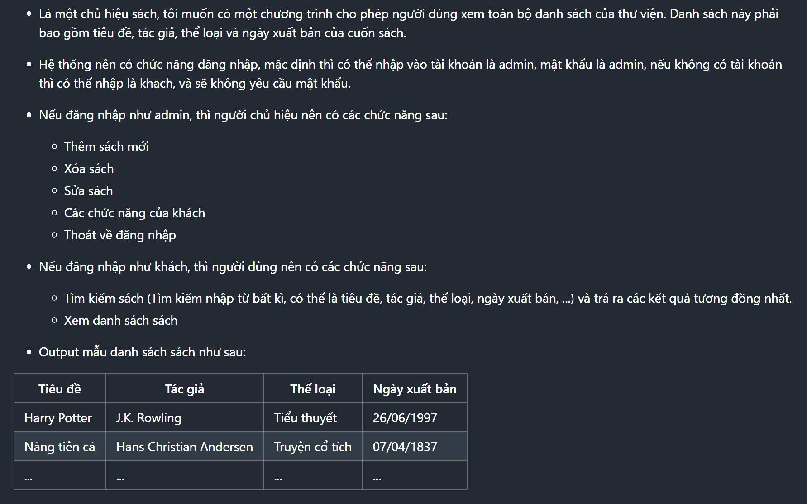

# [JAVA] - BUỔI 3

# CÁCH JAVA LƯU TRỮ DỮ LIỆU

### Problem

*Là một hiệu sách có tiếng trong vùng, Cường - chủ hiệu sách được biết đến là một người rất am hiểu sách, anh có thể nhớ hết sách trong cửa hàng thuộc loại gì ở kệ nào, để khi khách hỏi thì anh có thể phản hồi tức thì. Tuy nhiên do lượng khách ngày càng tăng cao, anh đã quyết định cải tiến quy trình của mình để khách hàng có thể sử dụng phần mềm giúp tìm kiếm sách nhanh hơn, và anh cũng nhẹ việc hơn nữa! Easy money with technology* 😉.

#### Yêu cầu của Cường

*Là một chủ hiệu sách, tôi muốn có một chương trình cho phép người dùng **xem toàn bộ danh sách của thư viện**. Danh sách này phải **bao gồm tiêu đề, tác giả, thể loại và ngày xuất bản của cuốn sách**.
Hệ thống nên có **chức năng đăng nhập**, mặc định khi vào hệ thống sẽ **yêu cầu tên đăng nhập, rồi sau đó nhập mật khẩu**. Hiện tại cửa hàng chỉ có 1 tài khoản duy nhất có thông tin (credential) là (admin/admin). Nếu không có tài khoản, khi nhập tên đăng nhập là "khach" thì không cần nhập mật khẩu.*

**1. NẾU ĐĂNG NHẬP NHƯ ADMIN, THÌ TÔI - CHỦ HIỆU NÊN CÓ CÁC CHỨC NĂNG SAU:**

- Thêm sách mới
- Xóa sách
- Sửa sách
- Các chức năng của khách để test
- Thoát tài khoản admin

**2. NẾU ĐĂNG NHẬP NHƯ KHÁCH, THÌ NGƯỜI DÙNG NÊN CÓ CÁC CHỨC NĂNG SAU:**

- Tìm kiếm sách (Tìm kiếm nhập từ bất kì, có thể là tiêu đề, tác giả, thể loại, ngày xuất bản, ...) và trả ra các kết quả tương đồng nhất.
- Xem danh sách sách
