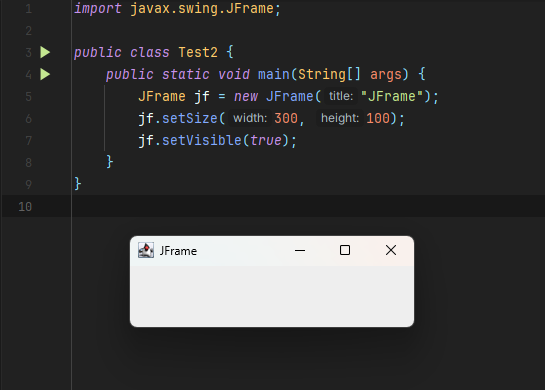
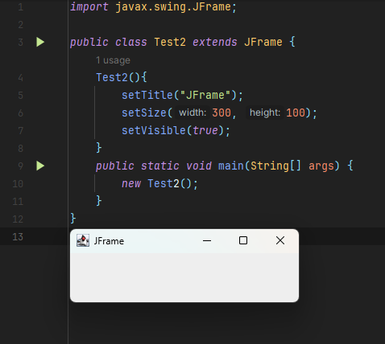
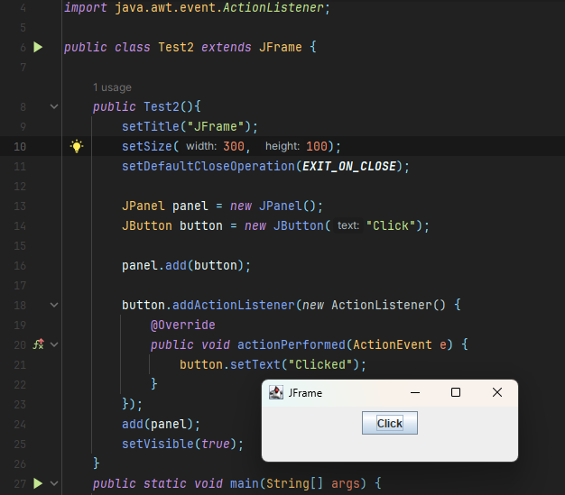
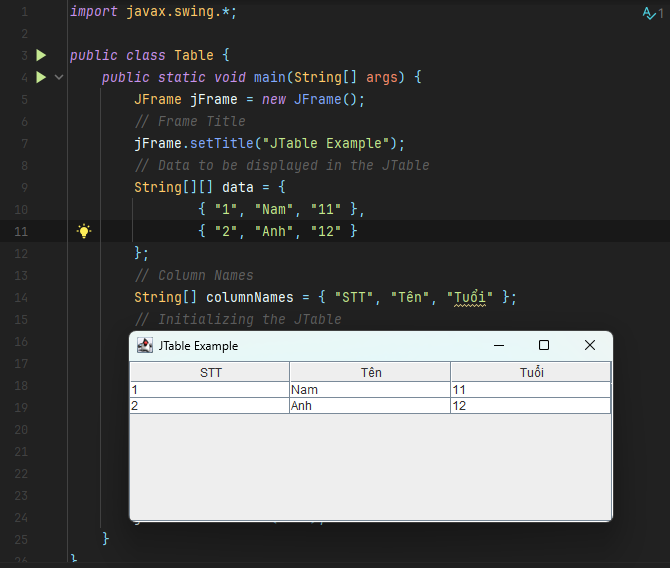
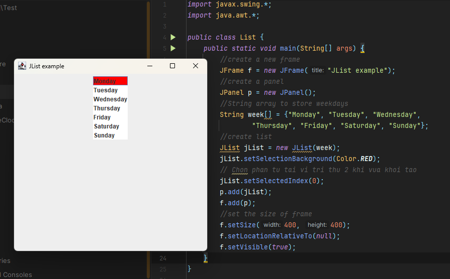
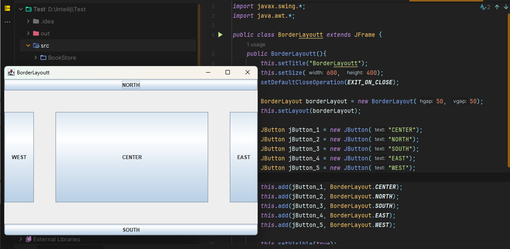
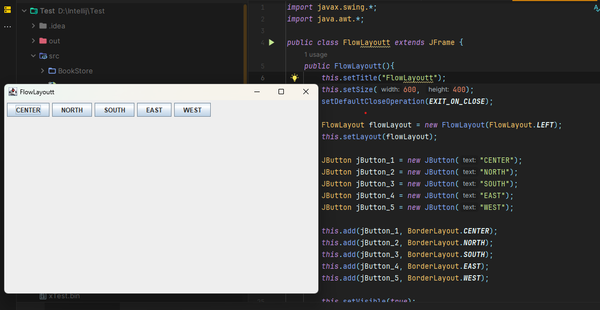
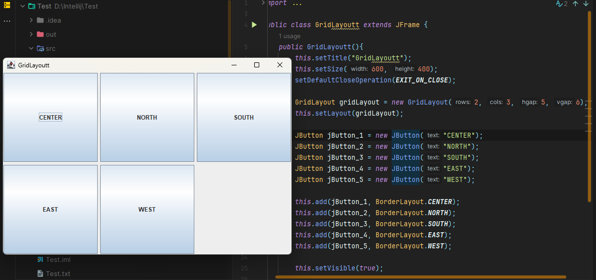
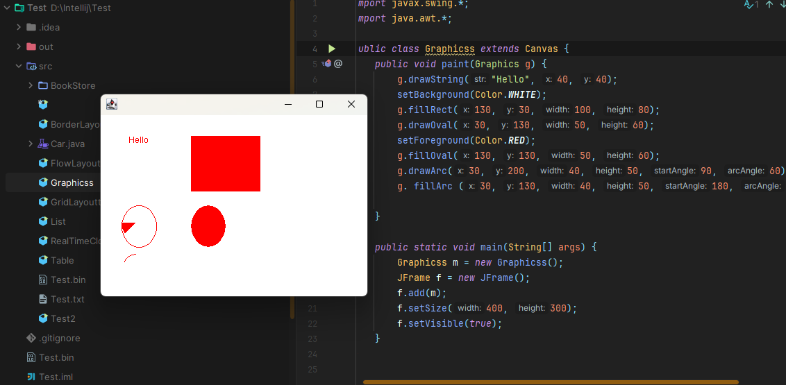

# [JAVA] - BUỔI 12
# THƯ VIỆN ĐỒ HOẠ SWING

```
Nội dung:
Thư viện đồ hoạ Swing cơ bản
JFrame, JButton, JLabel, JTextField, JTable, JList
BorderLayout, FlowLayout, GridLayout
Graphics2D, Image
Chuẩn bị:
Yêu cầu bài tập chuẩn bị: Một ứng dụng Swing khi ấn vào nút thì sẽ cập nhật 1 dòng chữ thời gian hiện tại trên ứng dụng (VD: 3:35 1/3/2024)
```
## I. Thư viện đồ hoạ Swing cơ bản
> Swing trong Java là một bộ công cụ Giao diện đồ họa người dùng (Graphical User Interface hay GUI) bao gồm các GUI component. 

- Swing cung cấp một bộ widget và package phong phú để tạo các **GUI** component phức tạp cho các ứng dụng Java. Swing là một phần của ***Java Foundation Classes*** (JFC), một API cho các chương trình Java cung cấp **GUI**.

- Thư viện ***Java Swing*** được xây dựng dựa trên Bộ công cụ tiện ích con trừu tượng Java, ***Abstract Windowing Toolkit*** ( **AWT** ), một bộ công cụ **GUI** phụ thuộc vào nền tảng cũ hơn.
- **GUI** là viết tắt của từ ***Graphic User Interface*** là giao diện người dùng đồ họa.

- Gói `javax.swing` cung cấp các lớp cho Java Swing API như JButton, JMenu, JLabel,...

- Các lớp và phân tầng Java Swing: 


- Tất cả các component trong Java Swing là JComponent có thể được thêm vào container class (lớp vùng chứa).
- Container class (lớp vùng chứa) là các class có thể chứa các component khác trên đó. Vì vậy, để tạo Java GUI, chúng ta cần ít nhất một container object (đối tượng vùng chứa). Java Swing có 3 loại container.
  - Panel (bảng điều khiển): là một container thuần túy và thực chất không phải là một window (cửa sổ). Mục đích duy nhất của Panel là tổ chức các component trên một window.
  - Frame (khung): là một window hoàn chỉnh có đầy đủ title (tiêu đề) và các icon (biểu tượng).
  - Dialog (hộp thoại): có thể được coi như một pop-up window sẽ bật ra khi một tin nhắn cần được hiển thị. Nó không phải là window hoàn chỉnh như Frame.

## II. JFrame, JButton, JLabel, JTextField, JTable, JList
### 1. JFrame

> JFrame là một container trong ứng dụng Java Swing, nó được dùng để chứa và sắp xếp các phần con như Button, Label, TextField,...

#### Cách tạo frame:
  - Tạo đối tượng lớp JFrame. 
  ```java
    import javax.swing.JFrame;

    public class Test2 {
        public static void main(String[] args) {
            JFrame jf = new JFrame("JFrame");
            jf.setSize(300, 100);
            jf.setVisible(true);
        }
    }
  ```

   

  - Kế thừa lớp JFrame.
  ```java
    import javax.swing.JFrame;

    public class Test2 extends JFrame {
        Test2(){
            setTitle("JFrame");
            setSize(300, 100);
            setVisible(true);
        }
        public static void main(String[] args) {
            new Test2();
        }
    }
  ```

   

#### Đóng frame
- Khi một JFrame được khởi tạo, cho đến khi người dùng tắt JFrame này thì chúng ta có thể định nghĩa các hành động tương ứng mà chúng ta muốn trong giai đoạn này. Java Swing cung cấp 4 hằng số tương ứng với 4 loại hành động sau khi một JFrame bị đóng. Các hằng số này được định nghĩa trong trong avax.swing.WindowsConstants:
  - DO_NOTHING_ON_CLOSE– Không làm thêm bất cứ điều gì khi JFrame bị đóng
  - HIDE_ON_CLOSE – JFrame sẽ bị ẩn đi khi người dùng đóng nó lại. Chương trình vẫn sẽ hoạt động bình thường trong khi JFrame này bị ẩn. Đây là một hành động mặc định của JFrame.
  - DISPOSE_ON_CLOSE – Sau khi bị đóng lại, nó đồng thời sẽ bị dọn dẹp rác, các tài nguyên được JFrame này sử dụng sẽ bị thu hồi nhường chỗ cho những nơi khác sử dụng.
  - EXIT_ON_CLOSE – Sau khi JFrame bị đóng, chương trình cũng sẽ tắt theo.
- Chúng ta có thể đặt hành vi đóng mặc định của JFrame bằng cách chuyển một trong bốn hằng số vào phương thức setDefaultCloseOperation () của nó.
- Ví dụ:
  
```java
    setDefaultCloseOperation(JFrame.EXIT_ON_CLOSE);
```
#### Hiển thị
- Mặc định khi Frame được khởi tạo thì vị trí xuất hiện của nó trên mành hình Desktop nằm ở phía trên bên trái cùng của màn hình. Kích thước tuỳ thuộc vào các component chứa trong nó.

- Để thay đổi kích thước và vị trí mặc định của Frame, ta có thể sử dụng:
  - setSize(width, height) – Chỉ định chiều rộng vào chiều cao của Frame
  - setLocation(int x, int y) – Chỉ định toạ độ của JFrame trên màn hình theo 2 trục X, Y
  - setBounds(int x, int y, int width, int height) – Cách sử dụng nhanh, gộp 2 hàm.
  - setLocationRelativeTo() - Căn Frame giữa màn hình Desktop

- Muốn kích thước của JFrame lớn bằng màn hình desktop, hay chiều rộng bằng với chiều rộng của màn hình Desktop thì JFrame cũng hỗ trợ một số tuỳ chọn:
  - NORMAL – Hiển thị kích thước thông thường
  - ICONIFIED – Hiển thị kích thước thu nhỏ
  - MAXIMIZED_HORIZ – Hiển thi với kích chiều rộng đạt kích thước tối đa
  - MAXIMIZED_VERT – Hiển thi với kích chiều cao đạt kích thước tối đa
  - MAXIMIZED_BOTH – Hiển thị với kích thước chiều cao và chiều rộng đạt kích thước tối đa
- Để sử dụng các tuỳ chọn trên chúng ta cần sử dụng setExtendedState() method với các tuỳ chọn tương ứng.

### 2. JButton
> Lớp JButton trong Java Swing được sử dụng để tạo một nút có thể click. Thành phần này tạo một sự kiện (event) khi được nhấn.

- Có thể tạo Button chứa chữ, hình hoặc cả 2.

```java
JButton button = new JButton("Click", new ImageIcon("D:\\Java Document\\PROPTIT-Java-Core\\image3buoi12.png"));
```
- Sự kiện:
```java
button.addActionListener(new ActionListener() {
    @Override
    public void actionPerformed(ActionEvent e) {
        // do everything here...
    }
});
```


### 3. JLabel
> Lớp JLabel trong Java Swing có thể hiển thị hoặc text (không được sửa bởi người dùng), hoặc hình ảnh hoặc cả hai. 

```java
 JLabel label = new JLabel("Hello");
```

- Để tùy chỉnh giao diện của JLabel trong Java Swing, bạn có thể sử dụng các phương thức và thuộc tính của nó. Dưới đây là một số tùy chọn phổ biến:
  - setFont(Font font) để đặt font chữ cho JLabel. Ví dụ: label.setFont(new Font("Arial", Font.BOLD, 16)).
  - setForeground(Color color) để đặt màu sắc của chữ trong JLabel. Ví dụ: label.setForeground(Color.RED).
  - setIcon(Icon icon) để đặt một biểu tượng (Icon) cho JLabel. Ví dụ: label.setIcon(new ImageIcon("image.png")).
  - setHorizontalAlignment(int alignment) để căn chỉnh văn bản theo chiều ngang. Các giá trị alignment có thể là SwingConstants.LEFT, SwingConstants.CENTER, SwingConstants.RIGHT. Ví dụ: label.setHorizontalAlignment(SwingConstants.CENTER).
  - setVerticalAlignment(int alignment) để căn chỉnh văn bản theo chiều dọc. Các giá trị alignment có thể là SwingConstants.TOP, SwingConstants.CENTER, SwingConstants.BOTTOM. Ví dụ: label.setVerticalAlignment(SwingConstants.CENTER).
  - setText(String text) để đặt nội dung văn bản cho JLabel. 
  - setToolTipText(String text) để đặt một thông báo gợi ý cho JLabel. Ví dụ: label.setToolTipText("This is a JLabel").
  - setSize(int width, int height) để đặt kích thước của JLabel. Ví dụ: label.setSize(200, 100).
  - setLocation(int x, int y) để đặt vị trí của JLabel trong container cha. Ví dụ: label.setLocation(50, 50).
### 4. JTextField
> Lớp JTextField trong Java Swing là một thành phần cho phép sửa đổi một dòng text.

```java
JTextField jTextField = new JTextField("Default Text");
```

- Trong JTextField có một thuộc tính gọi là columns được dùng để tính toán độ rộng của JTextField, mặc định nó là 0 nên khi không có dữ liệu thì kích thước của nó sẽ rất nhỏ. Để chỉ định columns cho JTextField có thể khởi tạo như sau:

```java
JTextField textField = new JTextField(50);
```
- Có thể chỉ định font chữ, kích thước, màu nền

```java 
textField.setFont(new java.awt.Font("Arial", Font.ITALIC | Font.BOLD, 12));
textField.setForeground(Color.BLUE);
textField.setBackground(Color.YELLOW);
```
- Vô hiệu hóa tính năng chỉnh sửa

```java
textField.setEditable(false);
```

### 5. JTable
> JTable là một trong những thành phần quan trọng của Java Swing package được sử dụng để hiển thị và chỉnh sửa dữ liệu theo dạng Table (Dữ liệu được trình bày theo dạng hàng và cột). Nó tương tự như một bảng tính trong excel file.

```java
import javax.swing.*;

public class Table {
    public static void main(String[] args) {
        JFrame jFrame = new JFrame();
        // Frame Title
        jFrame.setTitle("JTable Example");
        // Data to be displayed in the JTable
        String[][] data = {
                { "1", "Nam", "11" },
                { "2", "Anh", "12" }
        };
        // Column Names
        String[] columnNames = { "STT", "Tên", "Tuổi" };
        // Initializing the JTable
        JTable jTable = new JTable(data, columnNames);
        jTable.setBounds(30, 40, 200, 300);
        // adding it to JScrollPane
        JScrollPane sp = new JScrollPane(jTable);
        jFrame.add(sp);
        // Frame Size
        jFrame.setSize(500, 200);
        jFrame.setLocationRelativeTo(null);
        jFrame.setVisible(true);
    }
}
```



### 6. JList
> JList là một trong những component được sử dụng rất nhiều trong Java Swing giúp hiển thị một tập hợp các phần tử và cho phép người dùng có thể chọn một hoặc nhiều phần tử trong số chúng.

```java
import javax.swing.*;
import java.awt.*;

public class List {
    public static void main(String[] args) {
        //create a new frame
        JFrame f = new JFrame("JList example");
        //create a panel
        JPanel p = new JPanel();
        //String array to store weekdays
        String week[] = {"Monday", "Tuesday", "Wednesday",
                "Thursday", "Friday", "Saturday", "Sunday"};
        //create list
        JList jList = new JList(week);
        jList.setSelectionBackground(Color.RED);
        // Chon phan tu tai vi tri thu 2 khi vua khoi tao
        jList.setSelectedIndex(0);
        p.add(jList);
        f.add(p);
        //set the size of frame
        f.setSize(400, 400);
        f.setLocationRelativeTo(null);
        f.setVisible(true);
    }
}
```


## III. BorderLayout, FlowLayout, GridLayout
### 1. BorderLayout
> Lớp BorderLayout trong Java Swing sắp xếp các thành phần để phù hợp với 5 miền: EAST, WEST, SOUTH, NORTH và CENTER. Nó là layout mặc định của Frame hoặc Window. Mỗi khu vực (miền) chỉ có thể chứa một thành phần.

- Lớp BorderLayout bao gồm các trường sau:

  - static String AFTER_LAST_LINE: Giống PAGE_END.

  - static String AFTER_LINE_ENDS: Giống LINE_END.

  - static String BEFORE_FIRST_LINE: Giống PAGE_START.

  - static String BEFORE_LINE_BEGINS: Giống LINE_START.

  - static String CENTER: Đây là ràng buộc bố trí trung tâm (ở giữa container).

  - static String EAST: Ràng buộc bố trí theo hướng đông (cạnh phải của container).

  - static String LINE_END: Thành phần tới phần cuối của line direction cho layout

  - static String LINE_START: Thành phần tới phần bắt đầu của line direction cho layout

  - static String NORTH: Đây là ràng buộc bố trí theo hướng bắc (phần trên của container).

  - static String PAGE_END: Thành phần đến sau dòng cuối cùng (last line) của nội dung layout

  - static String PAGE_START: Thành phần tới trước dòng đầu tiên (first line) của nội dung layout.

  - static String SOUTH: Ràng buộc bố trí hướng nam (phần dưới của container)

  - static String WEST: Ràng buộc bố trí hướng tây (cạnh trái của container)

```java
import javax.swing.*;
import java.awt.*;

public class BorderLayoutt extends JFrame {
    public BorderLayoutt(){
        this.setTitle("BorderLayoutt");
        this.setSize(600, 400);
        setDefaultCloseOperation(EXIT_ON_CLOSE);

        BorderLayout borderLayout = new BorderLayout(50, 50);
        this.setLayout(borderLayout);

        JButton jButton_1 = new JButton("CENTER");
        JButton jButton_2 = new JButton("NORTH");
        JButton jButton_3 = new JButton("SOUTH");
        JButton jButton_4 = new JButton("EAST");
        JButton jButton_5 = new JButton("WEST");
        
        this.add(jButton_1, BorderLayout.CENTER);
        this.add(jButton_2, BorderLayout.NORTH);
        this.add(jButton_3, BorderLayout.SOUTH);
        this.add(jButton_4, BorderLayout.EAST);
        this.add(jButton_5, BorderLayout.WEST);

        this.setVisible(true);
    }

    public static void main(String[] args) {
        new BorderLayoutt();
    }
}
```



### 2. FlowLayout
>FlowLayout bố trí các thành phần con theo hướng từ trái sang phải hoặc từ phải sang trái trên cùng một dòng. Nếu tất cả các thành phần con không thể chứa trên cùng một dòng so với chiều dài tối đa của container thì chúng sẽ được sắp xếp trên một hàng mới.

- Lớp FlowLayout gồm các trường:
  - static int CENTER: Giá trị này chỉ rằng mỗi hàng của các thành phần nên được căn chỉnh vào giữa.

  - static int LEADING: Giá trị này chỉ rằng mỗi hàng của các thành phần nên được căn chỉnh theo cạnh chủ đạo (leading edge) theo hướng của container, ví dụ: căn chỉnh theo cạnh trái theo hướng left-to-right.

  - static int LEFT: Giá trị này chỉ rằng mỗi hàng của các thành phần nên được căn chỉnh trái.

  - static int RIGHT: Giá trị này chỉ rằng mỗi hàng của các thành phần nên được căn chỉnh phải.

  - static int TRAILING: Giá trị này chỉ rằng mỗi hàng của các thành phần nên được căn chỉnh theo cạnh trailing edge theo hướng của container, ví dụ: căn chỉnh theo cạnh phải theo hướng left-to-right.

```java
import javax.swing.*;
import java.awt.*;

public class FlowLayoutt extends JFrame {
    public FlowLayoutt(){
        this.setTitle("FlowLayoutt");
        this.setSize(600, 400);
        setDefaultCloseOperation(EXIT_ON_CLOSE);

        FlowLayout flowLayout = new FlowLayout(FlowLayout.LEFT);
        this.setLayout(flowLayout);

        JButton jButton_1 = new JButton("CENTER");
        JButton jButton_2 = new JButton("NORTH");
        JButton jButton_3 = new JButton("SOUTH");
        JButton jButton_4 = new JButton("EAST");
        JButton jButton_5 = new JButton("WEST");

        this.add(jButton_1);
        this.add(jButton_2);
        this.add(jButton_3);
        this.add(jButton_4);
        this.add(jButton_5);

        this.setVisible(true);
    }

    public static void main(String[] args) {
        new FlowLayoutt();
    }
}
```


### 3. GridLayout
> Trình quản lý GridLayout được sử dụng để bố trí các thành phần trong một lưới hình chữ nhật, lưới này đã được chia thành các hình chữ nhật có kích thước bằng nhau và một thành phần được đặt trong mỗi hình chữ nhật.

- Gồm các constructor:
  - GridLayout(): Tạo một grid layout với mặc định là một cột mỗi thành phần, trong một hàng đơn.

  - GridLayout(int rows, int columns): Tạo một grid layout với số hàng và cột đã cho, và không có khoảng cách giữa các thành phần.

  - GridLayout(int rows, int columns, int hgap, int vgap): Tạo một grid layout với các hàng và cột đã cho cùng với các khoảng cách theo chiều dọc và ngang đã xác định.

```java
import javax.swing.*;
import java.awt.*;

public class GridLayoutt extends JFrame {
    public GridLayoutt(){
        this.setTitle("GridLayoutt");
        this.setSize(600, 400);
        setDefaultCloseOperation(EXIT_ON_CLOSE);

        GridLayout gridLayout = new GridLayout(2, 3, 5, 6);
        this.setLayout(gridLayout);

        JButton jButton_1 = new JButton("CENTER");
        JButton jButton_2 = new JButton("NORTH");
        JButton jButton_3 = new JButton("SOUTH");
        JButton jButton_4 = new JButton("EAST");
        JButton jButton_5 = new JButton("WEST");

        this.add(jButton_1);
        this.add(jButton_2);
        this.add(jButton_3);
        this.add(jButton_4);
        this.add(jButton_5);

        this.setVisible(true);
    }

    public static void main(String[] args) {
        new GridLayoutt();
    }
}
```



## IV. Graphics2D, Image

>Lớp Graphics trong Java cung cấp nhiều phương thức để lập trình đồ họa.

- Một số phương thức được sử dụng phổ biến của lớp Graphics:

  - public abstract void drawString(String str, int x, int y): được sử dụng để vẽ chuỗi đã cho.

  - public void drawRect(int x, int y, int width, int height): vẽ một hình chữ nhật với độ rộng width và chiều cao height đã cho.

  - public abstract void fillRect(int x, int y, int width, int height): được sử dụng để điền màu mặc định và độ rộng và chiều cao đã cho vào hình chữ nhật.

  - public abstract void drawOval(int x, int y, int width, int height): được sử dụng để vẽ hình Ovan với độ rộng và chiều cao đã cho.

  - public abstract void fillOval(int x, int y, int width, int height): được sử dụng để điền màu mặc định và độ rộng và chiều cao đã cho vào hình Oval.

  - public abstract void drawLine(int x1, int y1, int x2, int y2): được sử dụng để vẽ line giữa hai điểm có tọa độ lần lượt là (x1, y1) và (x2, y2).

  - public abstract boolean drawImage(Image img, int x, int y, ImageObserver observer): được sử dụng để vẽ hình ảnh đã cho.

  - public abstract void drawArc(int x, int y, int width, int height, int startAngle, int arcAngle): được sử dụng để vẽ đường tròn circular hoặc elip.

  - public abstract void fillArc(int x, int y, int width, int height, int startAngle, int arcAngle): được sử dụng để điền một hình tròn hoặc elip.

  - public abstract void setColor(Color c): được sử dụng để thiết lập màu hiện tại của đồ họa thành màu color đã cho.

  - public abstract void setFont(Font font): được sử dụng để thiết lập font hiện tại của đồ họa thành font đã cho.

```java
import javax.swing.*;
import java.awt.*;

public class Graphicss extends Canvas {
    public void paint(Graphics g) {
        g.drawString("Hello", 40, 40);
        setBackground(Color.WHITE);
        g.fillRect(130, 30, 100, 80);
        g.drawOval(30, 130, 50, 60);
        setForeground(Color.RED);
        g.fillOval(130, 130, 50, 60);
        g.drawArc(30, 200, 40, 50, 90, 60);
        g. fillArc (30, 130, 40, 50, 180, 40);

    }

    public static void main(String[] args) {
        Graphicss m = new Graphicss();
        JFrame f = new JFrame();
        f.add(m);
        f.setSize(400, 300);
        f.setVisible(true);
    }
}
```

