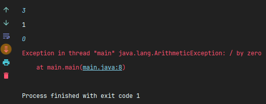

# [JAVA] - BUỔI 9 
# LUÔN CÓ NGOẠI LỆ, XỬ LÍ NGOẠI LỆ

```
Nội dung:
Làm quen với Exception: Checked và Unchecked Exception, Error
Bắt Exception với try-catch
Sử dụng finally
Cây phân cấp Exception, phân biệt throw và throws
Tạo ra Exception của riêng mình
```
## I. Làm quen với Exception
> Exceptions là một sự kiện xảy ra khi một chương trình đang chạy (thực thi), sự kiện đó làm cho luồng xử lý thông thường của chương trình không thể thực hiện một cách bình thường, thậm chí chết chương trình.
> Ví dụ, có thể gặp tình huống chia cho 0, không tìm thấy file hoặc truy cập tới phần tử ngoài mảng.


- Phân loại: Trong Java có 2 loại exception: checked và unchecked.
  - Checked Exception: xảy ra tại thời điểm biên dịch, hay còn được gọi là compile time exception. Đối với ngoại lệ này, cần phải xử lý ngay từ lúc viết chương trình. 
  
  
  - Unchecked Exception: là lỗi xảy ra trong quá trình chạy chương trình, còn được gọi là runtime exception. Ngoại lệ này sẽ được bỏ qua khi biên dịch nhưng khi thực thi chương trình sẽ báo lỗi.
  
  
- Error: Error là những vấn đề nghiêm trọng liên quan đến môi trường thực thi không thể kiểm soát. Nó thường làm chết chương trình. Lớp Error định nghĩa các ngoại lệ mà không thể bắt (catch) từ chương trình.
## II. Bắt Exception với try-catch
- Khối lệnh try trong java được sử dụng để chứa một đoạn code có thế xảy ra một ngoại lệ. Nó phải được khai báo trong phương thức.
- Cấu trúc:
```
try{
		// những khối lệnh có thể lỗi
	}
	catch(exception_class e){ // e là tên lỗi muốn xử lý
		// chương trình thực hiện khi gặp lỗi trên
	}
```
- Khi chạy chương trình, các câu lệnh trong khối try sẽ được thực thi, nếu gặp exception sẽ lập tức bỏ qua các câu lệnh tiếp theo trong khối và thực hiện các câu lệnh trong khối catch, còn được gọi là Exception Handling. Còn nếu không có lỗi thì sẽ thực hiện tiếp các câu lệnh, và khối catch không được thực hiện.
- Tham số trong khối catch là một Exception, trong đó tùy thuộc vào lỗi có thể xảy ra của chương trình mà người dùng sẽ sử dụng Exception cho phù hợp. Cụ thể trong đoạn code trên ta thấy chương trình sẽ gặp ArithmeticException khi nhập số 0.
  


- Khi sử dụng khối lệnh try/catch, sẽ có trường hợp chương trình gặp ngoại lệ nhưng không được xử lý:
  



## III. Finally
- Khối finally trong Java được dùng để thực thi câu lệnh bất kể có bắt được exception hay không.
- Khối lệnh finally trong java được khai báo sau khối lệnh try hoặc sau khối lệnh catch.
  


## IV. Cây phân cấp Exception, phân biệt throw và throws


- Tất cả các loại ngoại lệ và lỗi là các lớp con của lớp Throwable, là lớp cơ sở của hệ thống phân cấp.
- Các lớp ngoại lệ có quan hệ kế thừa, nên theo tính đa hình các ngoại lệ lớp cha cũng có thể dùng để xử lý ngoại lệ cho lớp con.
- Throw
  - Từ khóa throw được dùng để ném ra một ngoại lệ, thường sử dụng cho ngoại lệ người dùng tự định nghĩa.
  
  
- Throws
  - **Từ khóa throws được dùng để xử lý trong trường hợp muốn ném checked exception lại cho phương thức khác.** Các phương thức gọi đến phương thức sử dụng throws bắt buộc phải xử lý bằng cách sử dụng throws tương tự, hoặc xử lý ngoại lệ bằng try/catch.
  
  

  Xử lí bằng try/catch:

  

  
  
  Xử dụng throws tương tự:

  
## V. Tạo ra Exception của riêng mình
- Ngoài những ngoại lệ đã được định nghĩa trong Java, người dùng có thể tự đưa ra các trường hợp được coi là ngoại lệ của riêng mình. Một ngoại lệ mới phải là một lớp kế thừa từ lớp ngoại lệ có sẵn mới có thể sử dụng cơ chế xử lý ngoại lệ của Java.
  
  